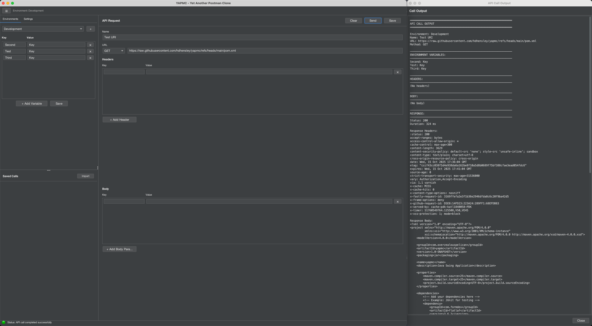

# ProtoCaller API Client

[](https://github.com/hdhensley/ProtoCaller/actions/workflows/ci.yml)
[](https://github.com/hdhensley/ProtoCaller/actions/workflows/release.yml)
[](https://github.com/hdhensley/ProtoCaller/releases)
[](https://github.com/hdhensley/ProtoCaller/blob/main/LICENSE)
[](https://github.com/hdhensley/ProtoCaller/issues)
[](https://github.com/hdhensley/ProtoCaller/releases)
[](https://adoptium.net/)
[](https://maven.apache.org/)


A privacy-focused, desktop API client built with Java Swing. Test REST APIs, manage environments, and organize your API calls - all stored locally on your machine.



## ✨ Features

- **🔒 Privacy First**: All data stored locally - no cloud, no tracking, no accounts
- **🌍 Environment Management**: Easily switch between Dev, Staging, Production, etc.
- **💾 Persistent Storage**: API calls and environments saved locally as JSON
- **📦 HAR Import**: Import API calls directly from browser HAR files
- **💻 cURL Import**: Paste cURL commands to create API calls quickly
- **🎨 Customizable Themes**: Choose from multiple FlatLaf themes to personalize your workspace
- **⚙️ Configurable Storage**: Set custom storage locations for your JSON files
- **🔄 Variable Substitution**: Use environment variables in URLs, headers, and body
- **📊 Response Viewer**: Formatted JSON responses with status codes and timing
- **📁 API Call Grouping**: Organize your API calls into collapsible groups with drag-and-drop
- **� Description Field**: Add optional multi-line descriptions to your API calls
- **🔀 Collapse/Expand All**: Toggle all groups open or closed from the Saved Calls toolbar
- **📐 Resizable Panels**: Drag dividers to customize panel sizes in the UI
- **�🚀 Modern UI**: Clean, responsive interface built with FlatLaf

## 🛠️ Requirements

### System Requirements

- **Java**: JDK 17 or higher (JDK 25 recommended for building)
  - Check your Java version: `java -version`
  - Download from [Adoptium](https://adoptium.net/) or [OpenJDK](https://openjdk.org/)

- **Maven**: Version 3.6 or higher (only needed for building from source)
  - Used for dependency management and building the project
  - Check your Maven version: `mvn -version`

### Dependencies

All dependencies are automatically managed by Maven. The project uses:

- **FlatLaf** (3.6.2): Modern, flat look and feel for Swing applications
  - Provides a contemporary UI that works across all platforms
  
- **FlatLaf IntelliJ Themes** (3.6.2): Additional theme options
  - Includes popular themes like Darcula and IntelliJ Light
  
- **GSON** (2.10.1): JSON parsing and serialization
  - Used for reading/writing configuration files and parsing JSON responses
  
- **Java Swing**: Built-in Java GUI framework (no external dependency)
  - Cross-platform desktop application framework

## 🚀 Getting Started

### Installation

#### Option 1: Download Pre-built Installers (Recommended)

Download the latest release for your operating system from the [Releases](https://github.com/hdhensley/ProtoCaller/releases) page:

- **Windows**: `pcac-1.0.exe` - Double-click to install
- **macOS**: `pcac-1.0.0.dmg` - Open and drag to Applications folder
  - ⚠️ **macOS users**: You may see a Gatekeeper warning. See [macOS Installation Guide](MACOS_INSTALL.md) for instructions on how to open the app safely.
- **Linux**: `pcac_1.0-1_amd64.deb` - Install with `sudo dpkg -i pcac_1.0-1_amd64.deb`

The installers include a custom JRE, so you don't need Java installed on your system!

**Note**: ProtoCaller Api Client is not notarized by Apple (requires $99/year), so macOS will show a security warning. The app is completely safe - all code is open source and auditable.

#### Option 2: Run the JAR File

If you have Java 17+ installed, you can download and run the JAR directly:

```bash
java -jar pcac-1.0-SNAPSHOT.jar
```

#### Option 3: Build from Source

1. **Clone the repository:**
   ```bash
   git clone https://github.com/hdhensley/pcac.git
   cd pcac
   ```

2. **Build the project:**
   ```bash
   ./mvnw clean package
   ```
   
   On Windows, use:
   ```cmd
   mvnw.cmd clean package
   ```

3. **Run the application:**
   ```bash
   ./mvnw exec:java
   ```
   
   Or run the JAR directly:
   ```bash
   java -jar target/pcac-1.0-SNAPSHOT.jar
   ```

### Quick Start Guide

1. **Select an Environment**: Choose from the dropdown in the top-right (Development, Staging, etc.)

2. **Configure Environment Variables**:
   - Click the "Manage" button
   - Add key-value pairs (e.g., `baseUrl` = `https://api.example.com`)
   - Click "Save"

3. **Create an API Call**:
   - Enter a name for your call
   - Enter the URL (use `{{variableName}}` for environment variables)
   - Select the HTTP method
   - Add headers (e.g., `Authorization: Bearer {{token}}`)
   - Add body parameters if needed
   - Click "Call" to execute or "Save" to store for later

4. **Import from HAR**:
   - Click the "Import" button in the Saved Calls panel
   - Select a `.har` file exported from your browser's Developer Tools
   - Choose which request to import
   - The call will be saved with the filename as its name

5. **Import from cURL**:
   - Click the "Import" button in the Saved Calls panel
   - Paste your cURL command into the dialog
   - Click "Import"
   - The call will be saved with a generated name
   
   **Supported cURL features**:
   - HTTP methods: `-X GET/POST/PUT/DELETE` or `--request`
   - Headers: `-H "Header: Value"` or `--header`
   - Body data: `-d`, `--data`, or `--data-raw` (supports JSON with nested quotes)
   - URLs with or without quotes
   - Automatic POST method detection when body data is present

6. **Organize with Groups**:
   - **Create a group**: Drag one saved API call onto another
   - You'll be prompted to enter a group name
   - Both calls will be grouped together under a collapsible header
   - **Add to existing group**: Drag any call onto a group header or onto a call within that group
   - **Expand/collapse groups**: Click the group header to show or hide its members
   - **Remove from group**: Drag a call out of the group onto an ungrouped call

7. **Customize Settings**:
   - Click the "Settings" button in the top-right
   - Choose your preferred theme from the dropdown
   - Optionally set a custom storage location for your JSON files
   - Click "Save" to apply changes

## 📁 Project Structure

```
pcac/
├── src/main/java/com/overzealouspelican/
│   ├── Main.java                          # Application entry point
│   ├── component/                         # Reusable UI components
│   │   ├── KeyValueInputGroup.java        # Headers/Body key-value input
│   │   ├── LabeledTextField.java          # Labeled text input
│   │   └── UrlWithMethodInput.java        # URL + HTTP method selector
│   ├── controller/                        # Business logic controllers (SRP)
│   │   ├── ApiCallDragDropHandler.java    # Drag-and-drop group assignment
│   │   ├── CallExecutionHandler.java      # HTTP call orchestration
│   │   ├── CallFormController.java        # API call form state management
│   │   ├── EnvironmentFormController.java # Environment persistence & dirty-state
│   │   └── SavedCallsListController.java  # Saved calls grouping & expand state
│   ├── dialog/                            # Standalone dialog windows
│   │   ├── ImportCurlDialog.java          # cURL import dialog
│   │   └── ImportHarDialog.java           # HAR file import dialog
│   ├── frame/                             # Application frames
│   │   ├── CallOutputFrame.java           # Response display window
│   │   ├── ImportFrame.java               # Import frame
│   │   └── MainFrame.java                 # Main application window
│   ├── model/                             # Data models
│   │   ├── ApiCall.java                   # API call configuration
│   │   ├── ApiCallGroup.java              # API call grouping
│   │   ├── ApplicationState.java          # Global app state
│   │   └── Environment.java              # Environment with variables
│   ├── panel/                             # UI panels (layout only)
│   │   ├── CallConfigurationPanel.java    # API request form
│   │   ├── EnvironmentEditorPanel.java    # Environment variable editor
│   │   ├── MainContentPanel.java          # Content layout
│   │   ├── SettingsEditorPanel.java       # Settings UI
│   │   ├── SidebarPanel.java             # Sidebar with tabs
│   │   ├── StatusPanel.java              # Bottom status bar
│   │   ├── ToolbarPanel.java             # Top toolbar
│   │   └── UrlPanel.java                 # Saved calls list
│   ├── service/                           # Data access and execution
│   │   ├── ApiCallPersistenceService.java # API call file I/O
│   │   ├── ApiCallService.java            # API call facade
│   │   ├── EnvironmentService.java        # Environment persistence
│   │   ├── HttpClientFactory.java         # HTTP client creation
│   │   ├── HttpRequestExecutor.java       # HTTP request execution
│   │   ├── SettingsService.java           # App settings persistence
│   │   ├── StoragePathService.java        # Storage location management
│   │   └── VariableSubstitutionService.java # {{var}} resolution
│   └── util/                              # Utilities
│       ├── ApiCallNameGenerator.java      # Name generation for imports
│       ├── CurlParser.java                # cURL command parsing
│       ├── FontUtils.java                 # Font management
│       ├── HarParser.java                 # HAR file parsing
│       ├── IconUtils.java                 # Icon loading
│       ├── SaveButtonStyler.java          # Save button visual state
│       └── UITheme.java                   # Theme constants and helpers
├── src/main/resources/icons/              # Application icons
├── pom.xml                                # Maven configuration
├── .github/workflows/release.yml          # CI/CD release pipeline
└── README.md                              # This file
```

## 🔧 Configuration

### Settings

Access application settings by clicking the "Settings" button in the control panel.

#### Theme Selection

Choose from four built-in themes:
- **FlatLaf Light**: Clean, bright interface (default)
- **FlatLaf Dark**: Easy on the eyes for extended use
- **FlatLaf IntelliJ**: Familiar IntelliJ IDEA light theme
- **FlatLaf Darcula**: Popular dark theme from IntelliJ

Themes are applied immediately and saved for future sessions.

#### Storage Location

By default, YAPMC stores data in OS-specific locations (see below). You can customize this:

1. Click "Settings" → "Browse..." to select a custom directory
2. Leave blank to use the default location
3. The app will offer to create the directory if it doesn't exist
4. Restart the application for the new location to take effect

**Note**: Changing storage location does not migrate existing data. You'll need to manually copy `environments.json` and `api-calls.json` to the new location if desired.

#### Reset Settings

Use the "Reset to Defaults" button to restore:
- Default theme (FlatLaf Light)
- Default storage location

### Data Storage Locations

**Default locations (when no custom location is set):**

- **macOS**: `~/Library/Application Support/YAPMC/`
- **Linux**: `~/.pcac/`
- **Windows**: `%APPDATA%\YAPMC\`

**Files stored:**
- `environments.json` - Environment configurations with variables
- `api-calls.json` - Saved API call configurations

**Settings persistence:**
- Application settings (theme, storage location) are stored using Java Preferences API
- These settings are separate from your API call data

## 🎨 User Interface

The application follows SOLID principles with a clean separation of concerns:

- **Panels** (UI only): Render layouts and delegate user interactions to controllers
- **Controllers**: Handle business logic, state management, and persistence orchestration
- **Services**: Provide data access, HTTP execution, and variable substitution
- **Dialogs**: Self-contained import workflows (cURL, HAR)

Key UI components:
- **Sidebar**: Environment editor with tabbed Environments/Settings views
- **Saved Calls Panel**: Grouped list with drag-and-drop, collapse/expand all toggle
- **API Request Panel**: Name, URL, description (resizable), headers, and body sections
- **Status Bar**: Real-time status updates
- **Call Output Window**: Formatted JSON responses with status codes and timing

## 🏗️ Building Installers

The project uses GitHub Actions with `jpackage` to create native installers for all platforms.

### Automated Builds (via GitHub Actions)

To trigger a release build:

1. Tag your commit: `git tag v1.0.0`
2. Push the tag: `git push origin v1.0.0`
3. GitHub Actions will automatically build installers for Windows, macOS, and Linux
4. Installers will be attached to the GitHub Release

### Manual Local Build

To create an installer on your local machine:

```bash
# Build the project
mvn clean package

# Create the installer with jpackage
jpackage \
  --input target \
  --main-jar pcac-1.0-SNAPSHOT.jar \
  --main-class com.overzealouspelican.Main \
  --name YAPMC \
  --type dmg \
  --app-version 1.0.0 \
  --vendor "YAPMC" \
  --description "Privacy-focused desktop API client" \
  --java-options '-Xmx512m'
```

Replace `--type dmg` with:
- `exe` for Windows
- `deb` or `rpm` for Linux
- `dmg` or `pkg` for macOS

### Benefits of jpackage

- **Self-contained**: Installers include a bundled JRE (no Java installation required)
- **Native experience**: Users get familiar installation process for their OS
- **Cross-platform**: Single command works on all operating systems
- **Easy distribution**: Simple to share and install

## 🔐 Security Note

Since all data is stored locally in plain text JSON files, be cautious about storing sensitive information like API keys or tokens directly in environment variables. Consider using temporary environment variables for sensitive data or implementing additional encryption if needed.

## 📝 License

This project is licensed under the MIT License - see the [LICENSE](LICENSE) file for details.

### What does this mean?

- ✅ Commercial use
- ✅ Modification
- ✅ Distribution
- ✅ Private use
- ❌ Liability
- ❌ Warranty

## 🤝 Contributing

Contributions are welcome! This is a FOSS (Free and Open Source Software) project built for the community.

### How to Contribute

1. Fork the repository
2. Create a feature branch (`git checkout -b feature/amazing-feature`)
3. Commit your changes (`git commit -m 'Add some amazing feature'`)
4. Push to the branch (`git push origin feature/amazing-feature`)
5. Open a Pull Request

### Guidelines

- Follow the existing code style and architecture patterns
- Test your changes thoroughly
- Update documentation as needed
- Keep the privacy-first principle in mind

## 📧 Contact

- **Issues**: Please use [GitHub Issues](https://github.com/yourusername/pcac/issues) for bug reports and feature requests
- **Discussions**: Join the conversation in [GitHub Discussions](https://github.com/yourusername/pcac/discussions)

---

**Built with privacy in mind. Your data stays yours.**
